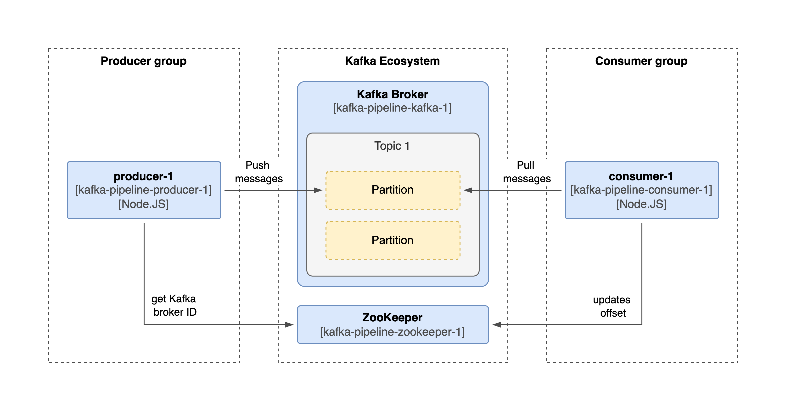
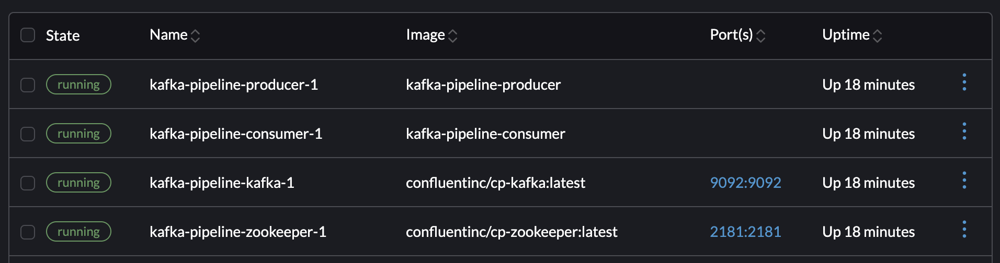

# Kafka Node.js Producer-Consumer Pipeline

This project demonstrates a simple Node.js-based producer-consumer application using Apache Kafka for message brokering. The producer sends a `Message [<Current timestamp>]` message to Kafka every 5 seconds, and the consumer reads and logs those messages. The application runs in Docker containers using Docker Compose for easy setup and orchestration.



## Project Structure

```
.
├── README.md
├── consumer
│   ├── Dockerfile
│   ├── package.json
│   └── src
│       └── consumer.js
├── producer
│   ├── Dockerfile
│   ├── package.json
│   └── src
│       └── producer.js
└── docker-compose.yml
```

## Prerequisites

- Docker installed
- Docker Compose installed

## Setup and Installation

1. **Clone the repository**
2. **Create `.env` files** (see environment variables description below)
3. **Build and start the services**

```
docker-compose up --build
```

## Running the Application

After running `docker-compose up --build`, the following containers will be started:

- **Kafka Broker** on port `9092`
- **Zookeeper** on port `2181`
- **Producer** (Node.js app sending messages to Kafka every 5 seconds)
- **Consumer** (Node.js app consuming messages from Kafka)



You will see logs for both the producer and consumer in the terminal.

## Stopping the Application

To stop the running containers, press `CTRL+C` or run:

```
docker-compose down
```

## Environment Variables

Create `.env` files in both the `producer` and `consumer` folders with the following variables:

### Producer (`producer/.env`):

```
KAFKA_BROKER_URL=kafka:9092
KAFKA_TOPIC=my-topic
INTERVAL_MS=5000
```

### Consumer (`consumer/.env`):

```
KAFKA_BROKER_URL=kafka:9092
KAFKA_TOPIC=my-topic
KAFKA_CONSUMER_GROUP_ID=my-consumer-group
```

## Resetting Kafka Offsets

To reset the consumer offsets to the beginning (if you want the consumer to reprocess all messages):

1. Stop the consumer

```
docker-compose stop consumer
```

2. Reset offsets to the earliest for the consumer group

```
docker exec -it kafka-pipeline-kafka-1 kafka-consumer-groups --bootstrap-server kafka:9092 --group test-group --topic test-topic --reset-offsets --to-earliest --execute
```

3. Start the consumer again

```
docker-compose start consumer
```

4. Inspect offset and lag

```
docker exec -it kafka-pipeline-kafka-1 kafka-consumer-groups --bootstrap-server kafka:9092 --describe --group test-group
```
